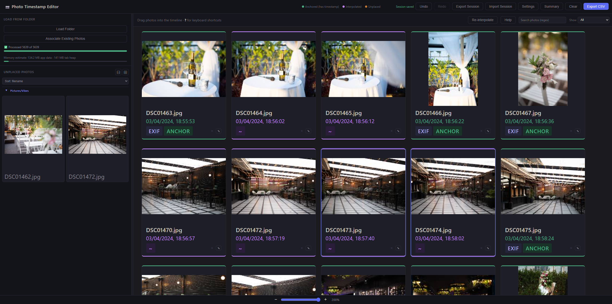
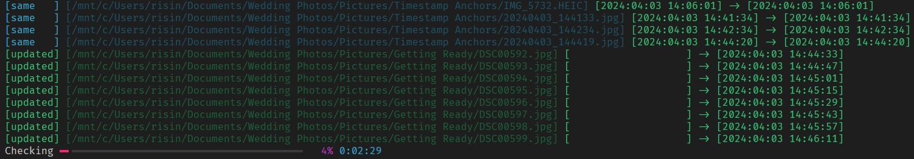

# EXIF Date Fixer

A local, browser-based editor for reconstructing photo capture times, then writing the resulting timestamps back to image files.

## Motivation

This was made for a wedding collection of roughly 5,500 photos. Around 3,000 had no usable “taken at” timestamp, an issue in the photographer's delivered files. The known timestamps provide chronological anchors: by placing the missing photos between them, the editor can interpolate plausible capture times from their order.

It is useful for the same situation whenever a batch contains a mixture of reliable and missing EXIF/XMP capture dates.

## Preview



## How it works

- Photos with an existing timestamp are placed on the timeline as anchors.
- Photos without one start in the **Unplaced Photos** panel.
- Arrange unplaced photos between anchors; the editor interpolates their timestamps from position.
- Add, edit, clear, or restore anchor timestamps as needed.
- Export the result as CSV, then optionally apply it to JPEG/WebP files with the included script.

The browser editor never uploads photos or changes the original files. It stores thumbnails, metadata, layout, selection, and scroll position locally in IndexedDB so that a session can be restored. Original files need to be associated again after reload for full-resolution viewing.

## Run the editor

Open `main.html` in a modern Chromium-based browser. The editor loads its EXIF parser from jsDelivr, so the initial load requires internet access.

1. Click **Load Folder** and choose the folder containing the photos.
2. Review timestamped photos in the timeline and missing ones in **Unplaced Photos**.
3. Drag photos into the desired timeline order. Use reliable photos as anchors.
4. Right-click a card to edit, clear, or restore its timestamp; clearing a metadata/manual timestamp makes that photo interpolated again.
5. Click **Export CSV**, choose the IANA timezone that the displayed clock values represent, and save the file.
6. Use the script below only after reviewing the CSV and backing up the photos.

**Associate Existing Photos** only reconnects files to an already-restored session. It does not add new photos; unmatched files are ignored. Use **Export Session** / **Import Session** to move a saved editor session between browsers or machines.

### Controls

| Action | Control |
| --- | --- |
| Search visible timeline photos by relative path (regular expression) | `/` |
| Open keyboard help | `?` |
| Select all visible photos | `Ctrl/Cmd + A` |
| Extend selection / toggle a card | `Shift-click` / `Ctrl/Cmd-click` |
| Move selected timeline photos | `←` / `→` |
| Remove selected photos from timeline | `Delete` |
| Undo / redo | `Ctrl/Cmd + Z` / `Ctrl/Cmd + Shift + Z` |
| Cut timeline photos, then paste after / before one selected photo | `Ctrl/Cmd + X`, `Ctrl/Cmd + V` / `Ctrl/Cmd + Shift + V` |
| Browse photos full-screen | Double-click a card, then `←` / `→` |

The timeline filter and search affect selection, bulk operations, fullscreen browsing, and keyboard movement: they operate only on visible matching photos.

## CSV export

The exported CSV contains the folder-relative path when available, a local timestamp with the chosen UTC offset, its UTC equivalent, timezone name, and whether the timestamp was interpolated. The visible clock value is treated as local time in the selected timezone. For example, `18:00:00` in `Asia/Jerusalem` exports with `+03:00` in summer and `+02:00` in winter.

## Apply timestamps to image files

`apply_timestamps.py` reads an exported CSV and updates `DateTime`, `DateTimeOriginal`, and `DateTimeDigitized` EXIF fields in JPEG/WebP files. It writes files in place; make a backup first.

```bash
python3 -m pip install -r requirements.txt

# Inspect every proposed change; writes nothing.
python3 apply_timestamps.py --dry-run photo_timestamps.csv /path/to/photos

# Apply changes, confirming each non-exact path match.
python3 apply_timestamps.py photo_timestamps.csv /path/to/photos

# Apply changes and accept suffix/basename auto-detection without prompts.
python3 apply_timestamps.py --accept-auto-detected photo_timestamps.csv /path/to/photos
```

### Dry-run output



The script first tries each CSV path relative to the supplied photo root.
If it cannot find an exact match, it displays an auto-detected suffix or basename match and asks before using it.
`--accept-auto-detected` suppresses those prompts.
Ambiguous matches are skipped, and files whose EXIF timestamp already matches the CSV are reported as `same` without being rewritten.

Output is prefixed with `updated`, `same`, or `skipped`; timestamps are shown as:
```
[original] -> [updated]
```

## Large collections and browser requirements

The editor has been used with approximately 5,500 photos. It uses worker-based import processing, lazy thumbnails, incremental DOM updates, timeline virtualization, and compact history to keep large collections responsive. **Settings** controls import worker concurrency and whether imports render incrementally.

Use a modern browser with Web Workers, `OffscreenCanvas`, `createImageBitmap`, Web Crypto, and IndexedDB. The app reports unavailable import capabilities.

## Development

The application is intentionally a standalone `main.html`; there is no build step. See [ARCHITECTURE.md](ARCHITECTURE.md) for the state model, persistence format, import pipeline, and rendering paths.
